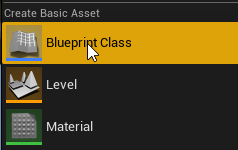

# Usage in Blueprints

## Call an Action

To execute an action we have to use the Action node.

You can find it by right clicking on a graph and searching for **"Action"**:

Then we have to assign the action class we want to use.

After this, **all its variables and delegates will show up** for you to use and the action is ready to execute.

## Create  an Action

To create an action, we have to go to  **content browser -> right click -> Blueprint Class**

Then we **select "Action" class** or one of Action's children

Then we **open the blueprint** we created.

All actions have 3 main events:

- **Activate**: When it gets created
- **Tick**: When it ticks, if it is enabled. TickRate is applied.
- **Finish**: When the action finished and why (*Success, Fail or Cancel*)

 Make sure your actions call **Succeed** or **Fail**. Otherwise the action will run until its owner is destroyed or the game closes. 